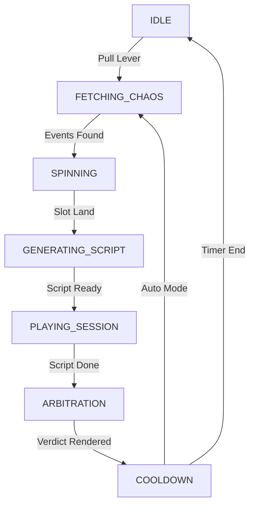

# 🏗️ SYSTEM ARCHITECTURE

## 🔭 OVERVIEW
The **AI Venting Machine** is a client-side **React** application written in **TypeScript**. It functions as a **State-Driven LLM Orchestrator**. 

Unlike typical chatbots, it does not rely on a single continuous context window. Instead, it breaks narrative generation into discrete, functional steps (Fetch -> Script -> Judge -> Evolve), simulating a complex system by chaining multiple specialized LLM calls.

---

## ⚙️ THE CORE LOOP (STATE MACHINE)

The application logic is driven by a finite state machine defined in `types.ts` (`MachineState`).



### 1. Fetching Chaos
- **Source**: `fetchLiveChaos` in `geminiService.ts`.
- **Logic**: Calls LLM to generate 5 "News Headlines" relevant to Game Dev/Tech.
- **Fallback**: If API fails, uses a hardcoded pool of events (Unity pricing, server fires, etc.).

### 2. Script Generation
- **Source**: `generateGroupVentScript`.
- **Logic**: 
    - Selects a "Focus Agent" (random rotation).
    - Selects 3 random "Support Agents".
    - Injects Agent Personalities + Crisis Context into a strict prompt.
    - **Prompt Engineering**: Requests a pipe-delimited format (`AgentID|Emotion|Text`) for easy parsing.

### 3. Playing Session
- **UI**: `VentSessionLog.tsx`.
- **Logic**: 
    - Parsed messages are displayed sequentially (2.5s delay).
    - **Audio**: If Gemini API key is present, `generateAgentAudio` calls the Gemini TTS endpoint for the active speaker.
    - **Stress**: `applyStressToAgents` increments agent stress counters based on participation.

### 4. Arbitration
- **Source**: `generateResolution`.
- **Logic**: 
    - Sends the chat history to the LLM with the persona of a "Judge".
    - Requests JSON output: `{ winnerId, action, reasoning, consensusScore }`.
    - Updates global game state based on the ruling.

### 5. Evolution
- **Source**: `evolveAgents`.
- **Logic**: 
    - The winner gets a "Win" counter increment.
    - Participating agents have their `evolution` string rewritten by the LLM to reflect the trauma or victory of the event.

---

## 💾 DATA & PERSISTENCE

### Storage Strategy
All state is persisted to `localStorage` to ensure the "Studio" survives browser refreshes.

| Key | Description |
| --- | --- |
| `vm_agents_cannon_chaos_v2` | Array of Agent objects (Stats, Evolution strings). |
| `vm_logs` | Array of system logs (The "Terminal" output). |
| `vm_llm_config_v9` | API Keys and Provider settings. |
| `vm_state` | Current machine state ID. |
| `vm_pressure` | Global "Studio Burnout" float (0-100). |

### Data Models (`types.ts`)

#### Agent
```typescript
interface Agent {
  id: string;
  name: string;
  role: string;
  personality: string; // The static "prompt" for the agent
  evolution: string;   // The dynamic "memory" string that changes over time
  stressLevel: number; // 0-100, determines visual glitching
  status: 'STABLE' | 'CONFLICT' | 'CRITICAL';
}
```

#### VentLog
The system logs everything to a "Console" (`TerminalOutput.tsx`). This serves as the system's long-term memory.
- **Compression**: When logs exceed a threshold (e.g., 60 entries), `archiveEpoch` calls the LLM to summarize them into a single "History" entry, freeing up context/storage.

---

## 🧠 AI INTEGRATION LAYER

The system uses a **Provider Agnostic** pattern (`geminiService.ts`).

### supported Providers
1.  **Google Gemini** (`@google/genai`): Native support. Best for TTS and speed.
2.  **OpenAI / Moonshot / Local**: Uses standard REST `fetch` to `/chat/completions`.

### Prompt Strategy
- **Role-Based Prompting**: Every call injects a specific persona ("You are a Scriptwriter", "You are a Judge", "You are a Psychologist").
- **Strict Formatting**: Prompts demand Pipe-Delimited (`|`) or JSON output to avoid regex nightmares on the client side.
- **Context Window Management**: 
    - The system does *not* send the entire chat history for every request.
    - It sends "Relevant History" (last 3 major events) or "Summary" (archived logs) to keep token costs low and speed high.

---

## 🎨 UI/UX DESIGN SYSTEM

### Aesthetic: "Cyber-Brutalist Sim"
- **Font**: `Share Tech Mono` (Google Fonts).
- **Palette**: Tailwind standard colors, heavily relying on `gray-900` (bg), `cyan-500` (accent), `amber-500` (warning), `red-500` (critical).
- **Effects**:
    - **Scanlines**: CSS overlay in `index.html`.
    - **Glitch/Shake**: Custom `@keyframes` animations triggered by `stressLevel > 90`.
    - **CRT Glow**: Box-shadow insets.

### Component Hierarchy
- `App.tsx`: Main Controller & State Container.
    - `PressureGauge`: Visualizes global entropy.
    - `SlotMachine`: Visualizes the "Input" (Crisis).
    - `VentSessionLog`: Visualizes the "Process" (Chat).
    - `ArbitrationOverlay`: Visualizes the "Output" (Decision).
    - `TerminalOutput`: Visualizes the "Memory" (Logs).
    - `LeverControl`: The user input trigger.
